# Martian Token Crowdsale

KaseiCoin is fungible token that is ERC-20 compliant and that will be minted by using a Crowdsale contract from the OpenZeppelin Solidity library. Martian Aerospace Agency wants to mint KaseiCoin and put on sale for human colony on Mars. “Kasei” means “Mars” in Japanese. You will launch a crowdsale that will allow people who are moving to Mars to convert their earthling money to KaseiCoin.
## Usage Scenario: Martian Token Crowdsale

Assume you will create a fungible token that is ERC-20 compliant and that will be minted by using a `Crowdsale` contract from the OpenZeppelin Solidity library.

The crowdsale contract that you create will manage the entire crowdsale process, allowing users to send ether to the contract and in return receive KAI, or KaseiCoin tokens. Your contract will mint the tokens automatically and distribute them to buyers in one transaction.

The following steps can guide about the process involed in this challenge:

- Create the KaseiCoin Token Contract
- Create the KaseiCoin Crowdsale Contract
- Create the KaseiCoin Deployer Contract
- Deploy the Crowdsale to a Local Blockchain
- Verify the transactions in MetaMask wallet and Ganache sandox environment

---

**Required Tools:**

The Solidity program is compiled and deployed over the Ethereum blockchain based sandbox environments called 'Remix VM (London)' and 'Injected Provider - MetaMask', which was previously called as Javascript VM. It will simulate the blockchain transactions defined in the smart contract.

Use the following tools to compile and deploy the program to test.

* [Remix Ethereum IDE](https://remix-project.org/) - Remix IDE, is a no-setup tool with a GUI for developing smart contracts.
* [Ethereum Unit Converter](https://eth-converter.com/) - Ether to Wei unit convertor.
* [Ganache](https://trufflesuite.com/ganache/) - Quickly fire up a personal Ethereum blockchain which you can use to run tests, execute commands, and inspect state while controlling how the chain operates.
* [MetaMask](https://metamask.io/) - A crypto wallet & gateway to blockchain apps

---

**References:**

* [Ethereum Smart Contract](https://ethereum.org/en/smart-contracts/) - A "smart contract" is simply a program that runs on the Ethereum blockchain. It's a collection of code (its functions) and data (its state) that resides at a specific address on the Ethereum blockchain.
* [ERC20](https://ethereum.org/en/developers/docs/standards/tokens/erc-20/) - The ERC-20 introduces a standard for Fungible Tokens, in other words, they have a property that makes each Token be exactly the same (in type and value) as another Token. For example, an ERC-20 Token acts just like the ETH, meaning that 1 Token is and will always be equal to all the other Tokens.
* [OpenZeppelin](https://docs.openzeppelin.com/contracts/2.x/api/token/erc20) - Set of interfaces, contracts, and utilities are all related to the ERC20 Token Standard.
--
## Usage

To use the smart contract, follow the key steps described as below:

- Clone the repository and load ***KaseiCoin.sol*** and ***KaseiCoinCrowdsale.sol*** in Remix IDE. You may see the web console view as:

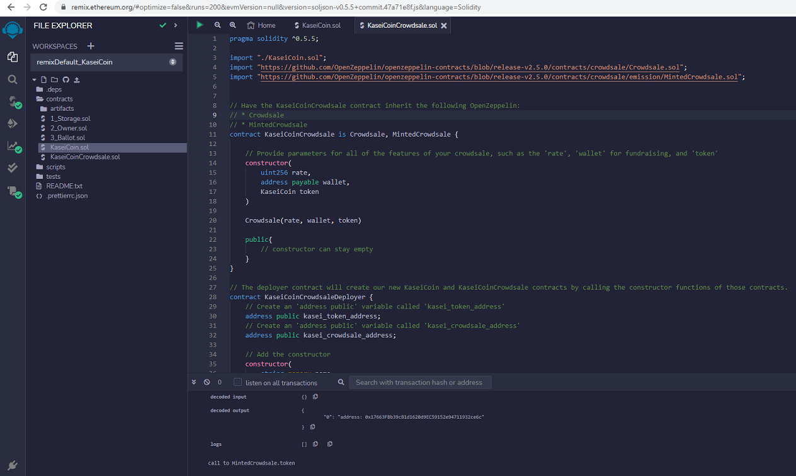

- While deploying, select Remix VM (London) as a sandbox environment.

- You may compile and deploy the smart contract to use it further.

- In order to integrate Remix IDE with MetaMask and MetaMask with Ganache, you may an article [here](https://www.geeksforgeeks.org/how-to-set-up-ganche-with-metamask/).

- Choose 'Injected Provider - MetaMask' as a sandbox blockchain Environment to connect Remix IDE with MetaMask. 

---
## Evaluation Evidence: KaseiCoin Minting and Deployment

**Note:** Take note of 'At Address' field values when deploying the contract *.sol files.

|Scenario: Compile KaseiCoin Contract|
|:-:|
|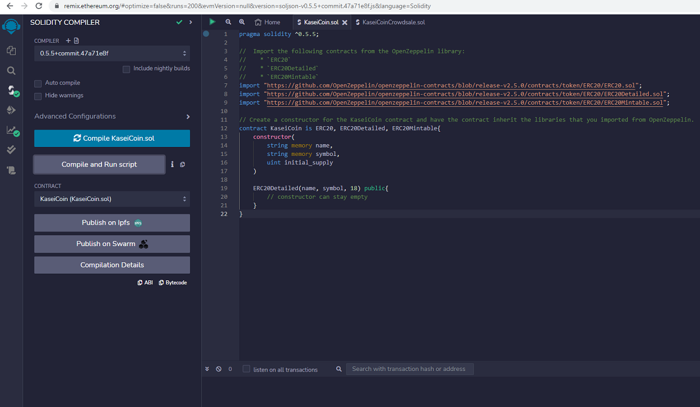|

---

|Scenario: Compile KaseiCoinCrowdsale Contract|
|:-:|
|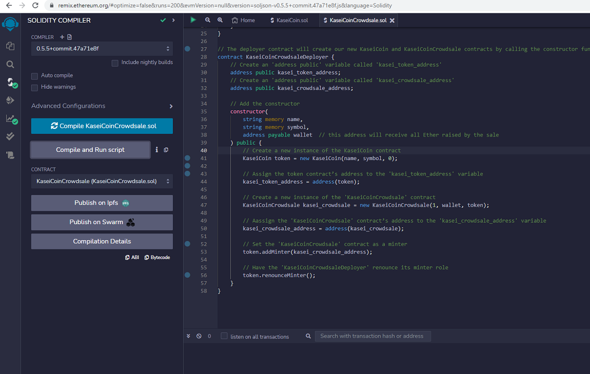|

---

|Scenario: KaseiCoinCrowdsaleDeployer with MetaMask|
|:-:|
|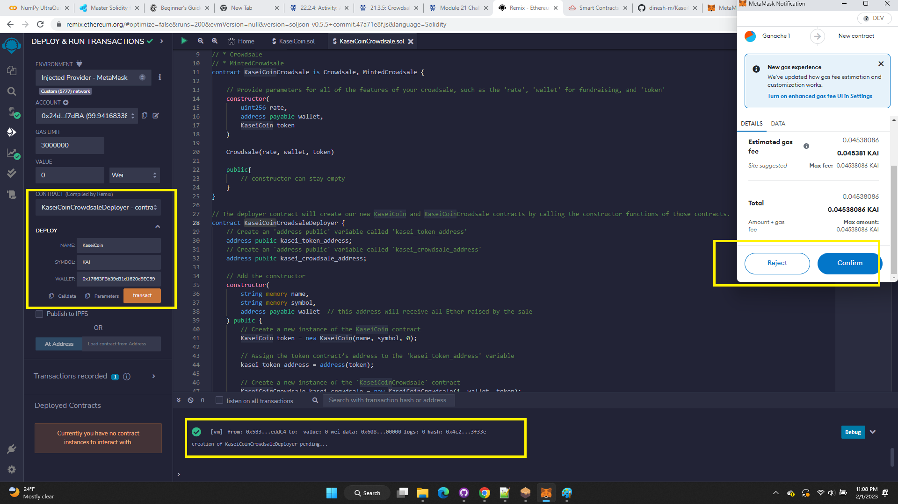|

---

|Scenario: KaseiCoinCrowdsaleDeployer Deployed|
|:-:|
|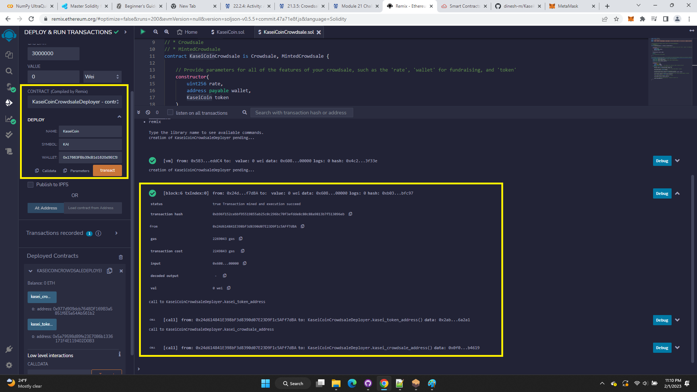|

---

|Scenario: KaseiCoinCrowdsale Deployed Address|
|:-:|
|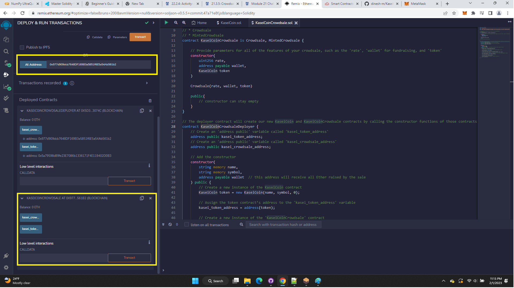|

---

|Scenario: KaseiCoin Purchased|
|:-:|
|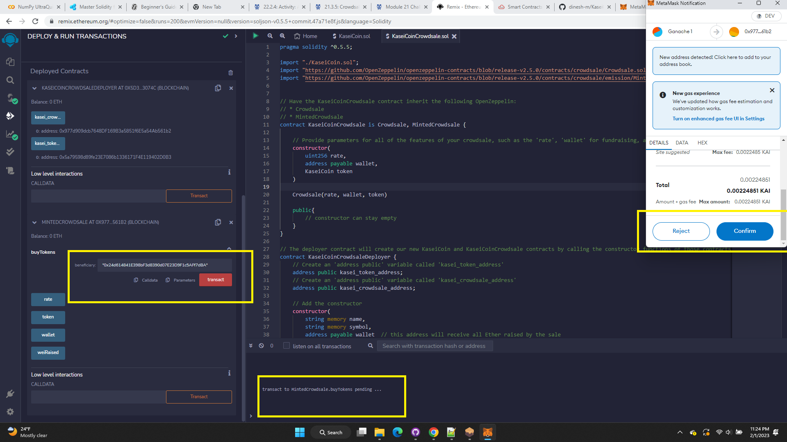|

---

|Scenario: KaseiCoin Contract Creation Evidence on Ganache|
|:-:|
|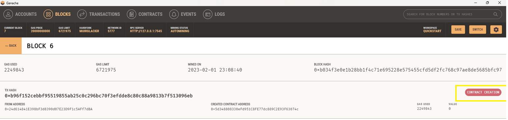|

---

|Scenario: KaseiCoin Contract Call Evidence on Ganache|
|:-:|
|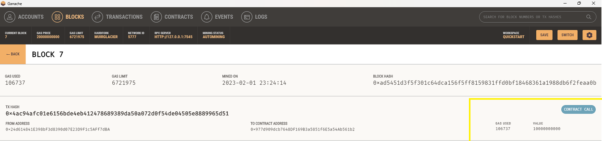|

---

|Scenario: KaseiCoin Contract Call Log Evidence on Remix IDE|
|:-:|
|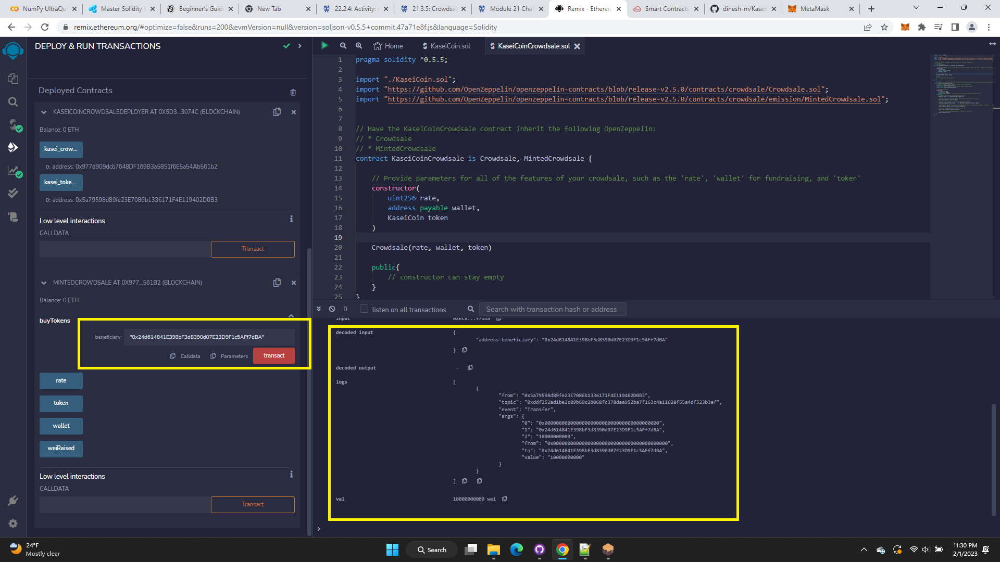|

---

|Scenario: KaseiCoin Wallet Details Evidence on Remix IDE|
|:-:|
|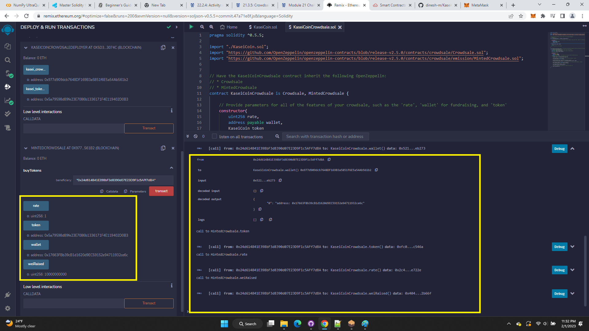|

---

|Scenario: KaseiCoin Activity Log Evidence on MetaMask|
|:-:|
|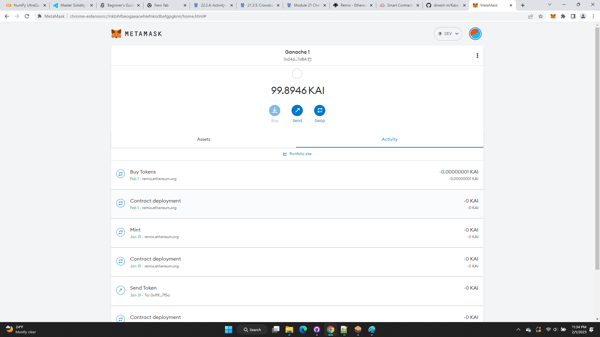|

---

## Contributors

FinTech Labs, Inc.

---

## License

